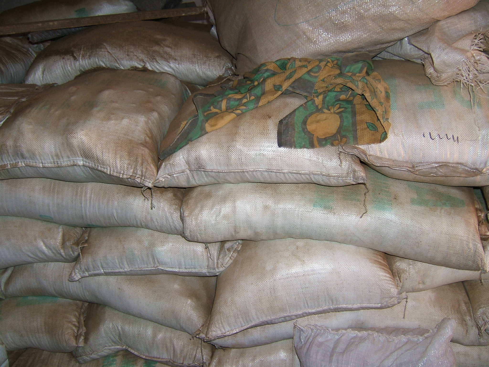

# Action design

You are funded for a 40% action frequency, and are using the forecast triggers of the table above.

Your agency has the following drought action:

## Procure/distribute Drought Tolerant Seeds

- These are quick growing and drought tolerant, but lower yield than the regular high yielding full season seed the farmers usually buy.

- If you fail to act before the season begins and it is a drought, even if you have already procured the seeds you will not have enough time to provide the seeds for the farmers to plant them before the season.  

- If you have not already procured the seeds, you would not be able to take any action with drought tolerant seeds relevant for that growing season.

- If you distribute the seeds and it is not a drought, you would have to use up your budget, and the farmers would have had lower yields with the drought tolerant seed than if they had used high yielding full season seeds. 

- If a drought season begins with the normal, high yielding seeds, there will be a sowing failure, 
	- the only way to get yields is with the drought tolerant seeds
	- Even if they get drought tolerant seeds after the sowing failure, the farmers will have lost lost of money paying the failed high yielding seed costs.

Look at the trigger and action table, remember the accuracy discussions from the previous slide.

Now think about what kinds of choices you are willing to take responsiblity for and answer the questions below:

 

