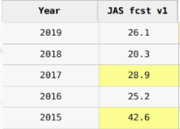

# Forecasts 

Now imagine that it is possible for the Met office to make a forecast available in April that tries to predict if the July-August-September agricultural season will be a drought.

You can look at the table above to see an actual example of this kind of forecast.  The forecast column lists the probability of drought, a higher number means a higher probability of drought.  

We can invert the math for when we would act to see how to use the forecast.   
The questions will walk you through that process.

 

