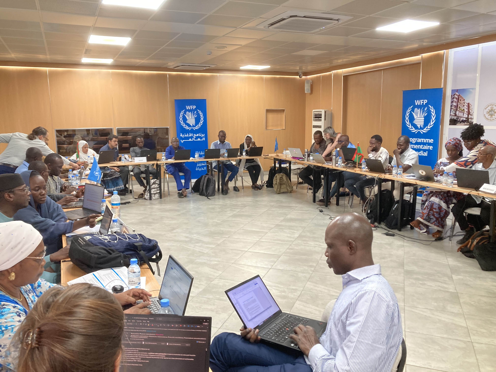

# Imagining Anticipatory Action

Last updated: 
Tue Jan 27 16:11:20 EST 2026

In this exercise you will imagine you are a disaster decisionmaker 
thinking about if it is possible to use forecasts to make disaster preparedness actions.

It is intended to introduce you to key concepts, terms, analysis, and trade-offs for Anticipatory Action projects.  

Enter your email to proceed (or any nickname to keep your comments organized):

 

